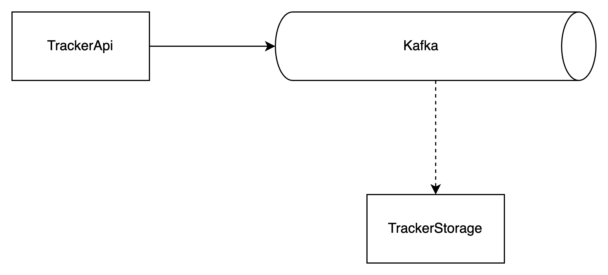

# Tracker
This system is composed by three components. An **API** that is responsible for handling requests, collect the necessary data and send it to **Kafka**. Then the **Storage** service consumes from Kafka and persists in a file.

This solution is an exercise to explore new .NET features and the usage of Kafka in a real scenario.